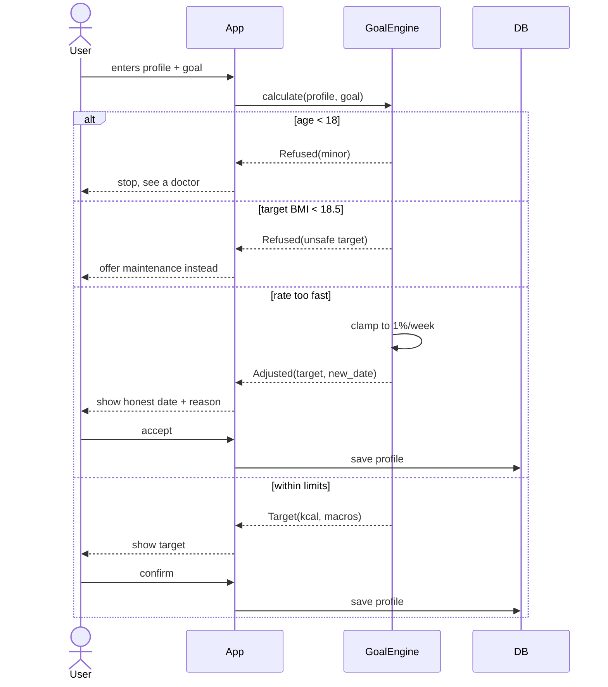
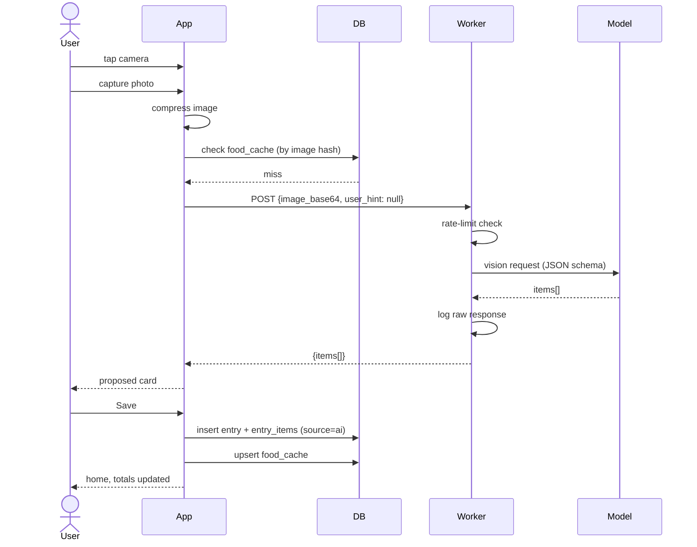
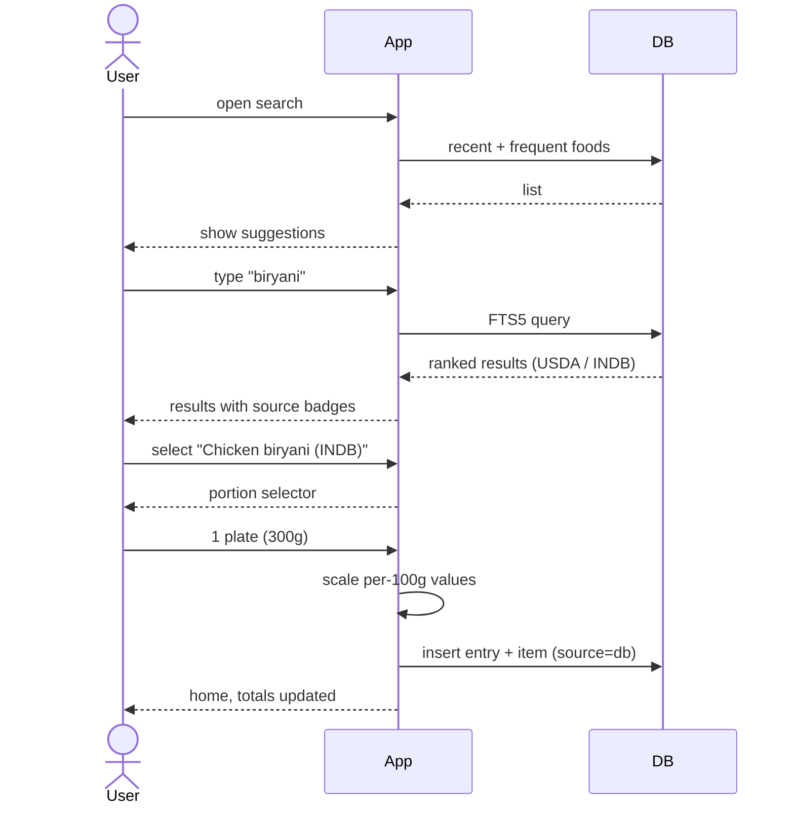
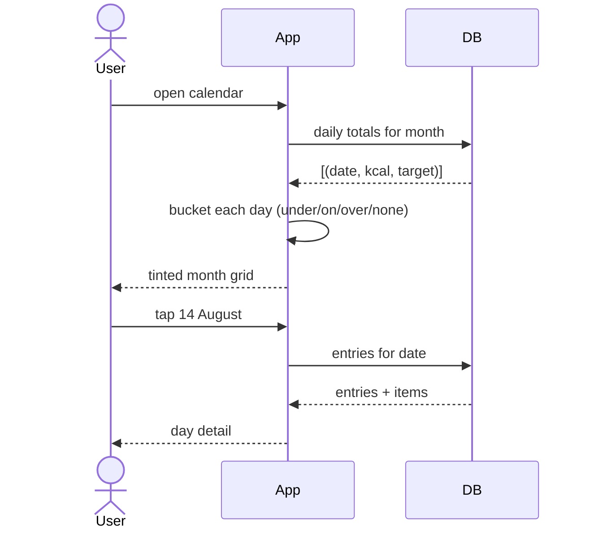
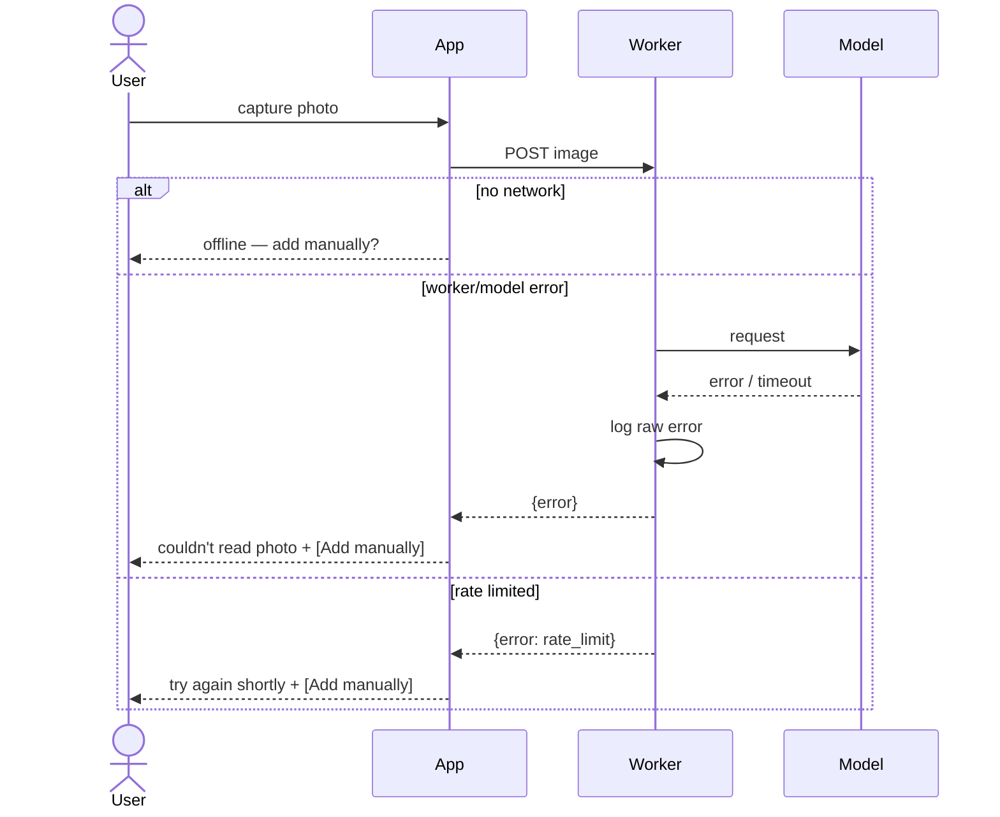

# Use Cases & Sequence Diagrams

Actors: **User**, **App** (Flutter client), **DB** (local SQLite), **Worker**
(Cloudflare), **Model** (Gemini via OpenRouter).

---

## Use case index

| ID | Name | Priority |
|---|---|---|
| UC-01 | Complete onboarding and receive a calorie target | Must |
| UC-02 | Onboarding refused on safety grounds | Must |
| UC-03 | Log a meal by photo | Must |
| UC-04 | Log a meal by photo with pre-entered details | Must |
| UC-05 | Log a meal manually from the database | Must |
| UC-06 | Correct a proposed item before saving | Must |
| UC-07 | Review the day | Must |
| UC-08 | Review the month via calendar | Must |
| UC-09 | Edit or delete a logged entry | Must |
| UC-10 | Change goal after setup | Should |
| UC-11 | Photo analysis fails | Must |
| UC-12 | Log a repeat meal (cache hit) | Should |

---

## UC-01 — Complete onboarding

**Precondition:** first launch, no profile.

**Main flow**
1. User enters sex, age, height, current weight
2. User enters target weight and desired timeframe
3. User selects activity level
4. App computes BMR → TDEE → rate → deficit → target
5. All safety constraints pass
6. App shows the daily target and macro split
7. User confirms; profile saved

**Postcondition:** profile exists, home screen reachable.

**Alternate:** any constraint fails → UC-02.

---

## UC-02 — Onboarding refused

**Trigger:** a safety constraint rejects the input.

| Condition | App response |
|---|---|
| Age < 18 | Stops. Suggests speaking to a doctor or guardian. No path forward. |
| Target BMI < 18.5 | Refuses target. Offers maintenance. |
| Current BMI < 18.5 + loss goal | Refuses. Offers maintenance. |
| Rate > 1% bodyweight/week | Clamps rate. Shows the honest achievable date. |
| Target below calorie floor | Clamps to floor. Extends the date. |

The last two are **corrections**, not rejections — the user continues with adjusted
numbers. The first three are hard stops.

Refusals appear inline at the input, in plain language, with the reason and an
alternative. No modal dialogs.

---

## UC-03 — Log a meal by photo

**Precondition:** profile exists.

**Main flow**
1. User taps the camera button
2. User takes a photo (skips the optional details field)
3. App compresses the image
4. App checks `food_cache` — miss
5. App sends image to Worker
6. Worker calls Model with schema-constrained prompt
7. Model returns items with macros and confidence
8. App renders the proposed card
9. User reviews and taps Save
10. App writes entry + items (`source = ai`) and updates `food_cache`

**Postcondition:** entry appears on home, day totals update.

---

## UC-04 — Photo with pre-entered details

**Difference from UC-03:** before capture, the user expands "Add details
(optional)" and types free text — e.g. *"chicken biryani, one plate, about 300g"*.

That string is sent as `user_hint` alongside the image. The model no longer has to
infer scale from pixels; it applies the numbers the user supplied.

**Expected effect:** materially better portion accuracy on meals where the user
bothers. Portion estimation is the documented weak point of every app in this
category, and this is the cheapest available fix.

**Constraint:** the field must never take focus automatically. Capture stays one
tap for users who skip it.

---

## UC-05 — Log manually from the database

**Trigger:** user forgot to photograph the meal, is logging retroactively, or
already knows what they ate.

**Main flow**
1. User opens search
2. App shows recent and frequent foods before any typing
3. User types a query
4. App runs FTS5 against `foods.sqlite`
5. App shows ranked results with source badges
6. User picks one
7. User selects portion — serving units first, grams secondary
8. App computes macros from per-100g values
9. App saves (`source = db`)

**Why a human is in this loop:** fuzzy matching is unreliable enough that a wrong
match must be rejectable. Ranked results plus human selection is safe. Automatic
matching behind a photo would not be.

---

## UC-06 — Correct a proposed item

**Main flow**
1. Proposed card is showing; a low-confidence item carries an amber edge and reason
2. User taps the portion on that item
3. User adjusts grams or serving count
4. App rescales that item's macros immediately
5. Totals update live
6. User saves

**Variations**
- Tap the name → edit text, or replace via DB lookup
- Tap any macro → edit the number directly
- Swipe → remove the item
- "Add item" → append a row not detected in the photo (drinks, a side)

Corrected values, once saved, are what land in `food_cache` — so the cache learns
from the user rather than from the model.

---

## UC-07 — Review the day

User opens home or taps a calendar day. App shows totals against target, entries
grouped by meal, and each item's macros. Over target renders neutrally.

---

## UC-08 — Review the month

**Main flow**
1. User opens calendar
2. App queries daily totals for the visible month
3. Each day renders as a tinted cell — under/on target, over, or unlogged
4. User taps a day → day detail
5. User navigates months

Unlogged days render as absent, never as failure.

---

## UC-09 — Edit or delete an entry

From day view: tap an entry to edit items, portions, or meal type; swipe to delete
with undo. Totals recompute immediately. Deleting an entry does not purge
`food_cache` — the learned nutrition values stay useful.

---

## UC-10 — Change goal

User opens Goal, edits any field. The engine re-runs live and shows the resulting
target before saving. All safety constraints reapply — including refusals. Past
entries are not retroactively re-evaluated against the new target.

---

## UC-11 — Photo analysis fails

**Triggers:** no network, Worker error, model timeout, rate limit hit, unparseable
response.

**Response:** *"Couldn't read that photo. Try again, or add the food manually."*
with a direct button to search. The photo is retained so a retry costs nothing.

The manual path is always available. A model outage never blocks logging — this is
why Phase 3 ships before Phase 6.

---

## UC-12 — Repeat meal (cache hit)

**Main flow**
1. User photographs a meal eaten before
2. Model returns `chicken biryani`
3. App normalises the name and finds it in `food_cache`
4. App uses cached per-100g values instead of the model's numbers
5. Item is marked `source = cache`

**Why:** same food gives the same numbers every time. Inconsistent values for a
repeat meal read as a bug and destroy trust faster than being slightly wrong.

The cache is populated by *accepted* values, so it converges on what the user has
already corrected.
